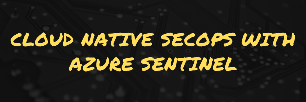

    

## Welcome

Welcome to the Cloud Native SecOps with Azure Sentinel workshop! This workshop was created as a walkthrough for an in person workshop, however you may feel free to run through at your own pace.   
### Some Pre-requisites

* An Azure Subscription
  * Ideally this is a PAYG subscription where you have full administrator permissions. We'll be performing some actions on Azure AD and other services that may require this level of access. 
  * You can sign up for a new Azure accout [here](https://azure.microsoft.com/free/?WT.mc_id=devops-0000-debryen)

### Agenda

The workshop is designed to take approximately 3-4 hours to complete. 

|    | Module                   | Format       |
|----|--------------------------|--------------|
| 01 | [Introduction to Sentinel](01_intro.md)                         | Presentation |
| 02 | [Getting Started / Setup](02_getting_started.md) | Hands on Lab |
| 03 | [Kusto Query Language](03_kql.md)                | Presentation |
| 04 | [Data Connectors and Workbooks](04_workbooks.md) | Hands on Lab |
| 05 | [Analytics Alerts](05_analytics.md)              | Hands on Lab |
| 06 | [Incidents and Investigations](06_incidents.md)  | Hands on Lab |
| 07 | [Threat Hunting](07_hunting.md)                  | Hands on Lab |
| 08 | [Automation with Playbooks](08_playbooks.md)     | Hands on Lab |
| 09 | [Design Considerations](09_patterns.md)                | Presentation |
| 10 | [Wrap / Clean Up](10_cleanup.md)                 | Hands on Lab |

----

